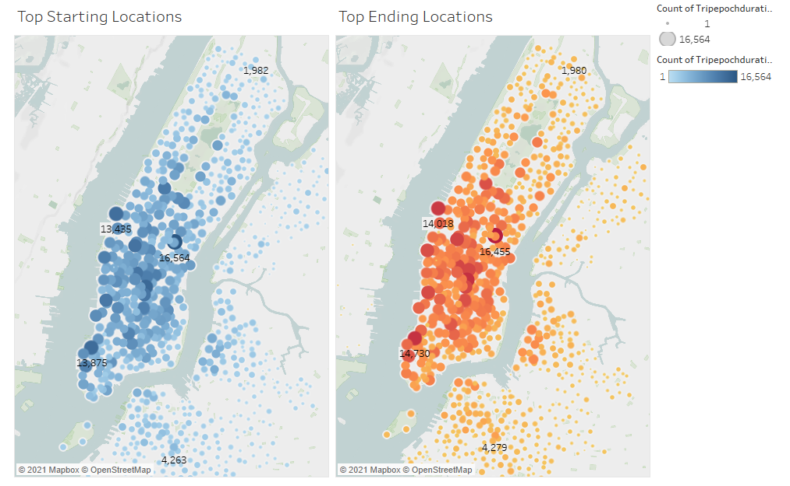
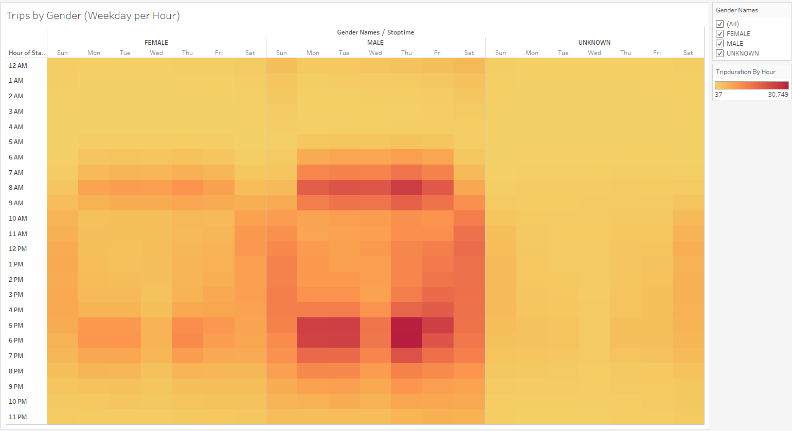
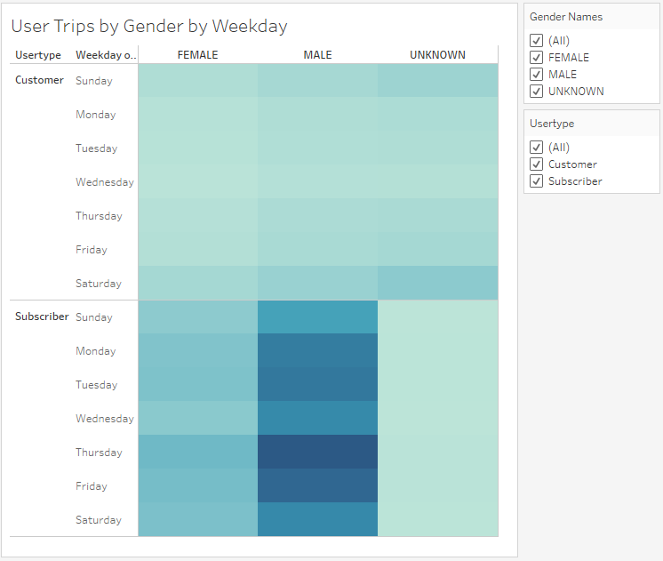
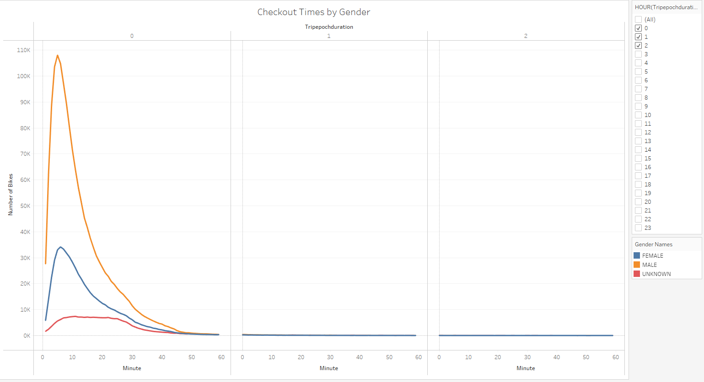
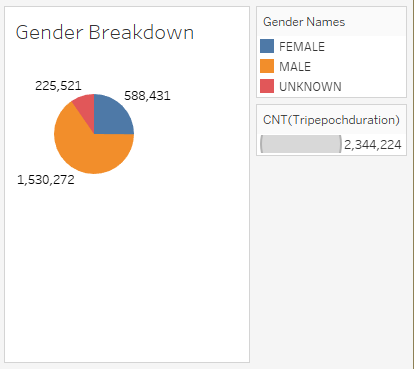
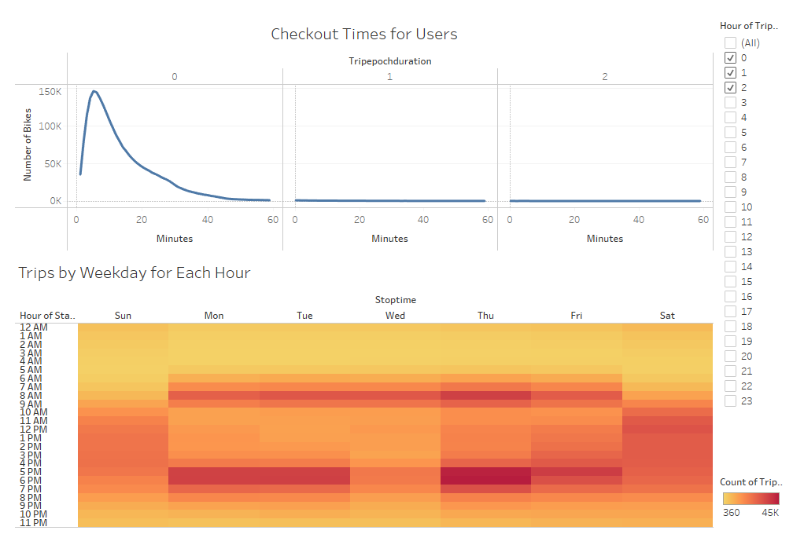
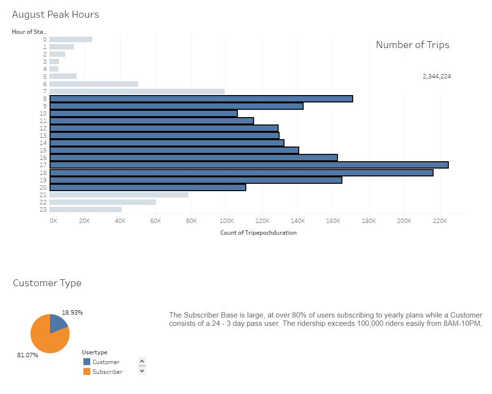
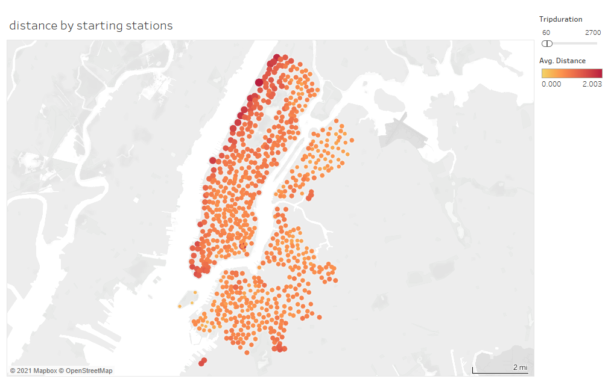
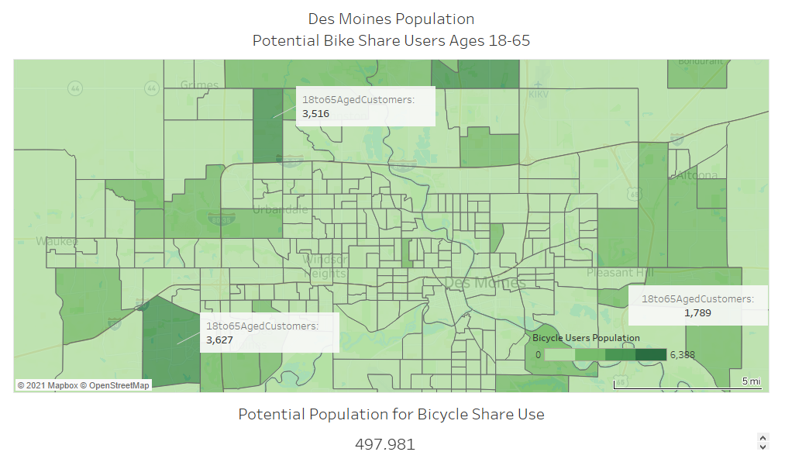

# Bike Sharing

CU-VIRT-DATA-PT-02-2021-U-B-TTH - Tableau - Module 14

Paul Do 2021/05/23

Link to the Tableau Story : https://public.tableau.com/profile/paul.do6643#!/vizhome/NYC_Citibike_Challenge_16217934118480/Story1?publish=yes

## Overview of the analysis:

NYC Citibike program has shown to be a tremendous success since it's implementation and expansion!

NYC has an excellent CitiBike program that boasts ridership in excess of 2.3 Million rides in a single month of August 2019, serving both ridership for working individuals commuting during peak travel hours and tourists alike.

## Results:

One of the biggest issues is the logistics of the Bike Share Program in it's most simplest ideas to execute is being able to provide bicycles where customers need them, which means transporting Bicycles from the most popular+overflowing destination to the most popular or most remote starting locations.

But in reviewing bicycle heat maps for starting and ending locations, we can see for many of the points that we have marked above, there is a bicycle replaced in the location, suggesting the fill rate is near equal for a bike to be departing from a station to another one that is being placed back. For location  40.71754834, -74.01322069, a starting value of 13,875 vs an ending value of 14,730 showed an surplus of 170 bikes returned back to the Rack location, with a standard deviation of 427.

In Regards to the Gender of the Ridership, Male Riders are the largest users of the CitiBike program, so either through marketing or through utility, Men account for 2.5 times more members than women recorded in the system.

Regardless of the population differences, men and women both have similar hours of usage of the transit system, where the heaviest usage is rush hour times from 6-9AM and again from 5-7PM on the weekdays, and relatively even usage on the weekends from 10AM to 7PM.

Disregarding Gender we can look at the Maximum usage of the system in the heatmap to determine the best times for maintenance as well. One thing to note is that CitiBike implemements a 45 Minute or Less time limit else users incurs fees. We also have to consider the ridership that might want to take a Bicycle for a trip longer than 45 minutes based on distances. However in the follow chart we also want to consider how far the average rider will ride a Citi-Bike for in that 45 minute timeframe.

## Summary:

An Additional Analysis should be to determine the average Distances ridden from starting points

Since the minimum ride considered to be a trip is 60 seconds, and the maximum ride that is billed to the users is when the trip exceeds past 45 Minutes (2,700 seconds). We find that the most there are users starting stations that can net a bicyclist a trip on average for approximately 2 miles. What we notice is that riders that can accomblish this distance though are at the perimeter of the island of Manhattan or the furtherst reaches of the Citi-Bike  stations. We will want to be certain to space the stations close enough to accomodate riders who can only ride short distances as well starting and ending points near the most popular spots.

Another Analysis, since Des Moines is not as populated as New York City, would to make a cost analysis to allow longer rides and how might weather affect Ridership.

Des Moines would require a Massive and mostly likely distanced station arrangement to reach residential population areas around the suburbs of the City Center, where distances are in excess of the 2 miles that a NYC CitiBike rider would typically ride in 45 minutes.

However, what the Population Map doesn't tell us is that there perhaps the City Center is mostly Businesses and Museums where a City Bike program would be useful to get around with, and could be integrated with the Public Transportation System.

1.) As it stands, Des Moines may have to eliminate or change the 45 minute time limit that CitiBike has before charging users a time fee.

2.) Since ridership can average more than 45 minute if Des Moines tries to interconnect populations zones with the city center, with conservative amounts of 2-3 hours to accommodate a trip of 5 miles to reach population centers outside of Des Moines center, There would also have to be a dependency or an allotment or refunds made for bad weather either for safety or for home.

3.) Des Moines will have to add several more stations with the knowledge that either ridership will hope on a station, wait for the time limit, and hope off to another bike station to ride further. A Logistics program has to be put in place to reallocate bicycles if the average use does not fit an point A to point B approach that.

Can a CitiBike Program work in Des Moines? Most certainly it can with some caveats that it can't base it's entire model on that of NYC CitiBike Program

